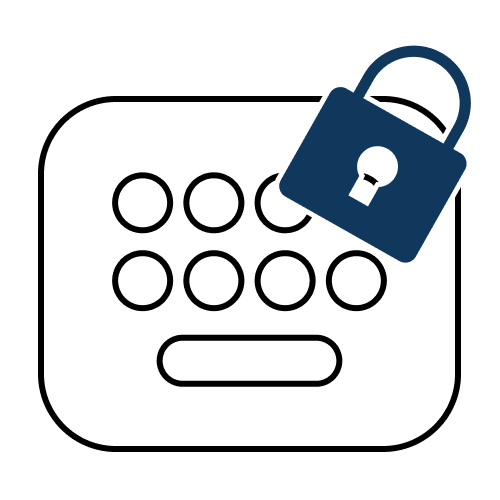
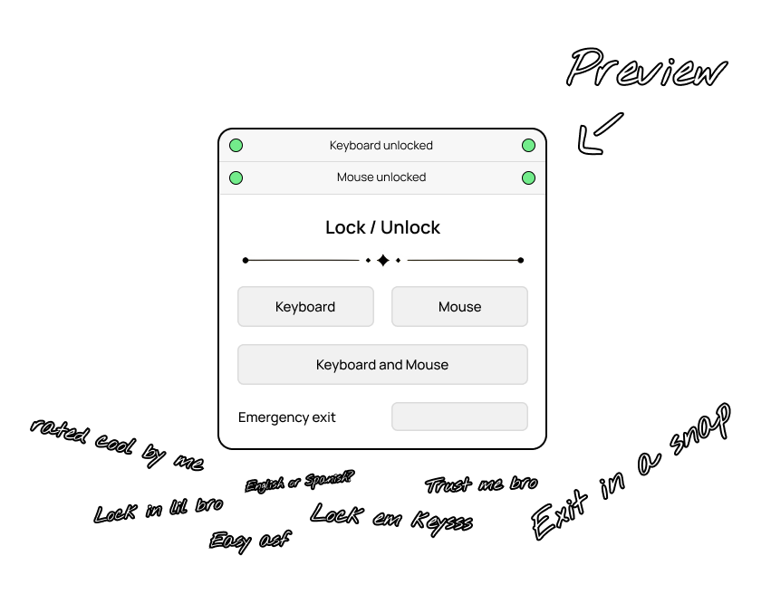

<p align="center">
    
</p>

<h3 align="center">keylock</h3>

<p align="center">Lock your keys with ease</p>

## 💠 Preview

<p align="center">
    
</p>

## 🎛️ Config file

You can make a file called `keylock.config` in the directory where the executable is. It will be used by the app to load the settings. All config options are:

```
&unlock@!@ctrl+q                # Shortcut to unlock (Examples: ctrl+q, alt+s, shift+ctrl+q)
&onstart_lock_keyboard@!@false  # Lock keyboard on start (true or false)
&onstart_lock_mouse@!@false     # Lock mouse on start (true or false)
&refresh_rate@!@1500            # Check for lock every x milliseconds (integer only)
&quit_after@!@never             # Exit app after some time (never or number in milliseconds, examples: 1000, 5000, never)
```

> [!Important]
> The "Mouse lock" button is a bit buggy. When you lock only mouse, if exit shortcut has "ctrl" then you can only use a-z characters and nothing else. This is not an issue when you lock only keyboard or both.

---

<p align="center"><a href="https://www.patreon.com/axorax">Support me on Patreon</a> — <a href="https://github.com/axorax/socials">Check out my socials</a></p>
